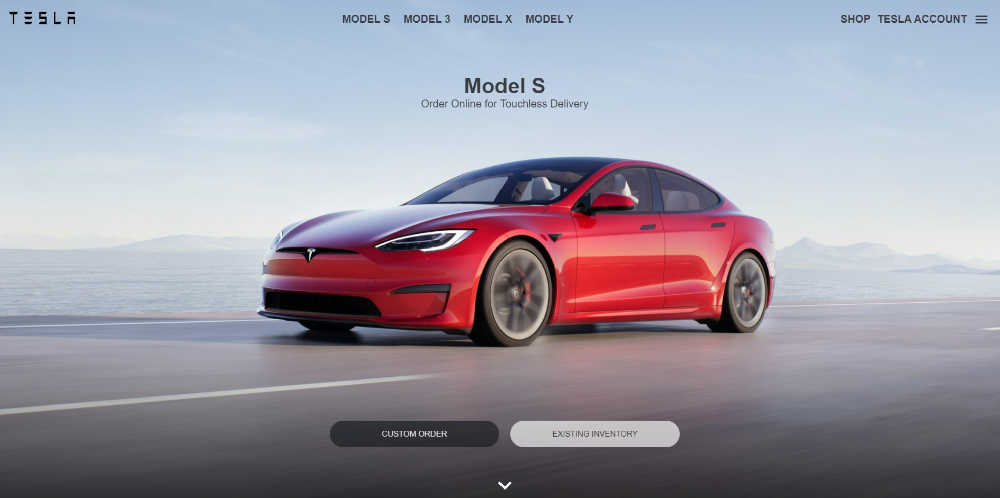

# Tesla Clone




> UI Clone do Site da Tesla 

## Site em produção
  Quem sabe faz ao vivo meu!
  
  [Tesla Clone](https://tesla-clone-958ef7.netlify.app/)

## 💻 Pré-requisitos

Antes de começar, verifique se você atendeu aos seguintes requisitos:
* Você possui o `Node Js` instalado em sua máquina?

## 🚀 Instalando Tesla Clone

Para instalar o Tesla UI Clone, siga estas etapas:

* Abra o terminal e navegue até a pasta do projeto e, depois:
```
npm install
```

## ☕ Usando Tesla Clone

Para usar, siga estas etapas:

Na raiz do projeto, execute no terminal:
```
npm run start
```
Fique à vontade para contribuir!
